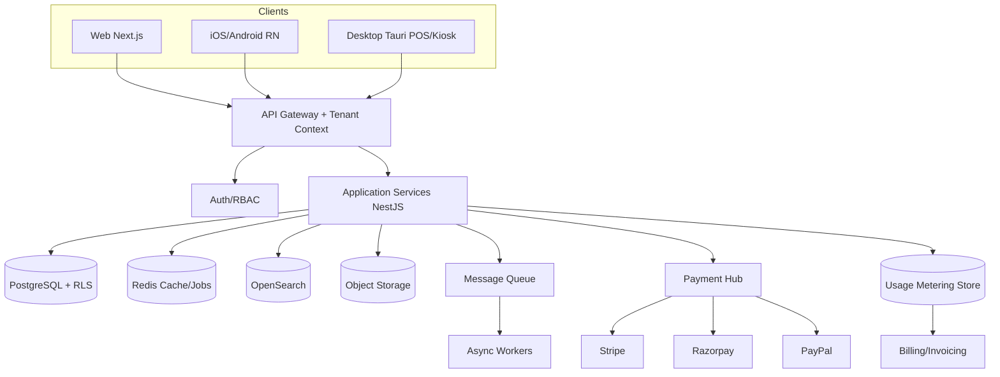

# Temple Management System (TMS) - Product Requirements Document (PRD)

> Global, multi-tenant, multi-currency Temple Management SaaS for temples in the USA, India, Canada, and other countries.
> Status: Draft v1 (for build). This document is written to be handed directly to an AI coding agent or development team.

## Table of Contents

1. Overview & Vision
2. Personas & Roles (RBAC)
3. Functional Modules (Must-have)
4. Advanced / Highlight Features
5. UI/UX Requirements & Client Platforms
6. Non-Functional Requirements
7. Multi-Tenancy & Scalability Architecture
8. Multi-Currency & Internationalization
9. Payments & Gateways
10. Security & Compliance
11. Integrations & APIs
12. Recommended Tech Stack & High-Level Architecture
13. Data Model (High Level)
14. Deployment, DevOps & Manageability
15. Per-Customer Environments, Provisioning & Metered Billing
16. Subscription Plans & Pricing Model
17. Phased Roadmap (MVP -> v1 -> v2)
18. Glossary

---

## 1. Overview & Vision

### 1.1 Summary
The Temple Management System (TMS) is a cloud-based SaaS platform that digitizes and unifies every
aspect of running a temple or religious trust - devotee engagement, service/pooja bookings, donations,
finance, operations, governance, and analytics - across web, mobile, and desktop, for institutions in
multiple countries and currencies.

### 1.2 Goals
- Replace manual registers and disconnected tools with one integrated, transparent system.
- Increase devotee convenience (online/mobile booking, donations, live darshan) and engagement.
- Give trustees and accountants real-time financial transparency and audit-ready, tax-compliant records.
- Operate globally: multi-tenant, multi-currency, multi-language, country-specific tax/compliance.
- Be ultra-fast, highly available, and easily scalable, deployable, and manageable.

### 1.3 Target users
Trustees/management, temple admins, accountants, priests/archakas, front-desk/counter staff,
kitchen (Madapalli) staff, volunteers, devotees/members and donors (incl. NRI/diaspora), and the
platform operator (SaaS provider).

### 1.4 Success metrics (examples)
- % of bookings and donations done online/self-service vs counter.
- Reduction in average devotee wait/queue time during festivals.
- Time to generate audit-ready financial and tax (80G/IRS/CRA) reports.
- Tenant onboarding time (sign-up to live environment).
- System uptime/SLA, p95 API latency, and successful payment rate.

---

## 2. Personas & Roles (RBAC)

The platform is **role-based** with fine-grained permissions. Roles are configurable per tenant; the
roles below are seeded defaults. A user may hold multiple roles, and roles can be scoped to a branch.

### 2.1 Default roles
- **Platform Super Admin** (SaaS operator) - manages all tenants, environments, billing, global config.
- **Tenant Owner / Trustee** - full access within a tenant; governance, approvals, all reports.
- **Temple Admin** - day-to-day administration, configuration, staff, content.
- **Accountant / Finance** - donations, accounting, receipts, tax docs, reconciliation, financial reports.
- **Front Desk / Counter** - bookings, POS, receipting, devotee lookup, token issue.
- **Priest / Archaka** - assigned poojas/duties, schedule, completion marking.
- **Kitchen (Madapalli) Staff** - prasadam/annadanam prep, distribution, inventory consumption.
- **Volunteer Coordinator** - volunteer opportunities, scheduling, hours approval.
- **Volunteer** - view/sign up for shifts, check-in/out, view assigned tasks.
- **Devotee / Member** - bookings, donations, receipts/tax docs, membership, profile (self-service).
- **Auditor (read-only)** - read access to financials and logs for audit.

### 2.2 RBAC requirements
- Permissions are action + resource based (e.g., `donation:create`, `report:view`, `environment:provision`).
- Roles are composable; custom roles can be created per tenant.
- All access is tenant-scoped and (optionally) branch-scoped.
- Every privileged action is recorded in the audit log (who, what, when, before/after).
- Support SSO and MFA (see Section 10).

### 2.3 Role / capability matrix (summary)

| Capability | Super Admin | Trustee | Admin | Accountant | Front Desk | Priest | Volunteer Coord | Devotee |
| --- | --- | --- | --- | --- | --- | --- | --- | --- |
| Manage tenants/environments | Yes | No | No | No | No | No | No | No |
| Configure modules/settings | No | Yes | Yes | No | No | No | No | No |
| Bookings (create/manage) | No | Yes | Yes | Partial | Yes | View own | No | Own |
| Donations & receipts | No | Yes | Yes | Yes | Yes | No | No | Own |
| Accounting & tax docs | No | Yes | Partial | Yes | No | No | No | No |
| Priest scheduling | No | Yes | Yes | No | Partial | View own | No | No |
| Volunteer management | No | Yes | Yes | No | No | No | Yes | Self |
| Reports & dashboards | Platform | All | Most | Finance | Counter | Own | Volunteer | Own |
| Governance (AGM/voting) | No | Yes | Partial | No | No | No | No | Vote |

---

## 3. Functional Modules (Must-have)

Each module lists: description, key features, representative user stories, and acceptance criteria (AC).
Modules are grouped: A. Devotee & Engagement, B. Services/Poojas & Bookings, C. Donations & Finance,
D. Operations & Resources, E. Governance & Insights.

### Group A - Devotee & Engagement

#### 3.A.1 Devotee / Member Management & CRM
**Description:** Central, secure database of all devotees, members, and donors with full history.

**Key features**
- Profiles: name (in English + regional script/transliteration), photo, contacts, address/country, DOB.
- Religious attributes: gotra, nakshatra/star, rashi; family/household linkage (link members of a family).
- Important dates (birthday, anniversary, star-day, shraddha) with automatic reminders.
- Full history: donations, bookings, receipts, communications, membership.
- Segmentation/tags; NRI/overseas flag; consent & communication preferences (opt-in/opt-out per channel).
- Self-service profile management via web/app; import (CSV) with de-duplication and merge.

**User stories**
- As an admin, I can find a devotee by phone/email/name/membership ID and view their full history.
- As a devotee, I can update my own profile and communication preferences from the app.
- As an admin, I can import a list of devotees and the system flags/merges duplicates.

**Acceptance criteria**
- AC1: Creating a devotee with a duplicate phone/email triggers a merge/duplicate warning.
- AC2: Important-date reminders fire on schedule via configured channels.
- AC3: All PII access is tenant-scoped and audit-logged; opt-out preferences are always respected.

#### 3.A.2 Membership & Pledges
**Description:** Manage member types, onboarding, renewals, and digital membership cards.

**Key features**
- Multiple member types/tiers (e.g., annual, lifetime, patron) with configurable benefits/pricing.
- Onboarding with approval workflow; pending-renewal list and automated renewal reminders.
- Digital membership cards with QR; optional biometric (fingerprint) verification.
- Pledges: record commitments, schedules, reminders, and fulfilment tracking.

**Acceptance criteria**
- AC1: Expiring memberships auto-generate reminders at configurable intervals.
- AC2: A renewed membership updates validity, card QR, and member history.
- AC3: Pledge balances reduce automatically as linked donations are received.

#### 3.A.3 Volunteer Management (Seva / Kainkaryam)
**Description:** Full volunteer lifecycle - registry, opportunities, scheduling, hours, recognition.

**Key features**
- Volunteer registry & profiles (skills/interests, availability, service areas), linked to devotee record.
- Opportunities & recruitment: admin posts opportunities; self-service browse & sign-up (web/app/forms);
  one-time, recurring, and festival roles; waitlists and auto-fill of open spots.
- Shift scheduling & assignment: duty rosters for daily rituals and festivals; reminders via
  WhatsApp/SMS/email; substitute/swap requests.
- Check-in & hours tracking: QR / mobile / kiosk check-in-out; GPS/geo-fenced auto-logging of hours.
- Recognition & reporting: volunteer hours & activity reports, top-contributor recognition,
  certificates/appreciation; performance visibility for committees.

**User stories**
- As a volunteer, I can browse open shifts and sign up myself without waiting for approval.
- As a coordinator, I can fill a festival roster and notify all assigned volunteers at once.
- As a volunteer, I check in via QR at the temple and my hours are logged automatically.

**Acceptance criteria**
- AC1: Self-signup respects role capacity and waitlists; an open spot auto-notifies waitlisted volunteers.
- AC2: Geo-fenced check-in only logs hours when within the configured location radius.
- AC3: Hours reports can be exported and filtered by date, event, and volunteer.

#### 3.A.4 Communication Hub
**Description:** Unified, multi-channel outreach to devotees, members, and volunteers.

**Key features**
- Channels: WhatsApp, SMS, email, push notifications.
- Broadcasts with text, image, PDF, video links; templates; segmentation/targeting.
- Transactional messages (booking confirmations, receipts, reminders, renewals, AGM/voting notices).
- Form generation: applications, feedback, volunteer sign-ups, surveys.
- Delivery tracking and per-channel opt-in/opt-out compliance.

**Acceptance criteria**
- AC1: A broadcast can target a saved segment and reports delivered/failed counts.
- AC2: Devotees who opted out of a channel are excluded from non-transactional messages.

#### 3.A.5 Temple Website + Devotee Mobile App
**Description:** Public, per-tenant website and devotee apps for engagement and self-service.

**Key features**
- Per-tenant website: history, deities, timings, events, gallery, news, online services, donations.
- Devotee app/web portal: bookings, donations, receipts & tax docs, membership, live darshan, content.
- Per-tenant theming/branding and custom domain; SEO-friendly public pages; multilingual.

**Acceptance criteria**
- AC1: A tenant can configure branding, domain, languages, and which services appear online.
- AC2: A devotee can complete a booking + payment end-to-end from web and app.

#### 3.A.6 Grievance / Feedback / Enquiry
**Description:** Capture and resolve devotee enquiries, feedback, and complaints.

**Key features**
- Ticketing with category, priority, assignment, status, SLA, and resolution notes.
- Multi-channel intake (app/web/front desk); devotee can track status; satisfaction rating.

**Acceptance criteria**
- AC1: Each ticket has a lifecycle (open -> in progress -> resolved -> closed) with audit trail.
- AC2: The submitter is notified on status changes.

### Group B - Services, Poojas & Bookings

#### 3.B.1 Services & Poojas Catalog
**Description:** Define and price all bookable services the temple offers.

**Key features**
- Define services: poojas, archana, abhishekam, sevas, homam, special rituals; recurring or one-time.
- Pricing, taxes, member discounts; multi-currency price display.
- Capacity/slots, prerequisites (gotra/nakshatra inputs), required offerings, duration, assigned deity.
- Sponsorship/ubayam; year-long service bundles bookable in a single transaction.

**Acceptance criteria**
- AC1: A service can be configured with slots, price, required devotee inputs, and online availability.
- AC2: Member discounts apply automatically based on the booking devotee's membership.

#### 3.B.2 Seva / Pooja / Archana / Darshan Booking
**Description:** Omni-channel booking (online, counter, kiosk, mobile) with real-time availability.

**Key features**
- Time-slot booking; VIP/special darshan; capacity and overlap prevention.
- Capture gotra/nakshatra/sankalpa details; multiple beneficiaries; recurring bookings.
- Instant confirmation + receipt via WhatsApp/SMS/email/app; QR for entry.
- Reschedule/cancel with configurable policy; waitlist for full slots.

**User stories**
- As a devotee, I book an archana for a chosen date/slot, enter my gotra/nakshatra, pay, and get a receipt.
- As front desk, I book a walk-in pooja and print/send a receipt instantly.

**Acceptance criteria**
- AC1: Two devotees cannot book the same exclusive slot; availability updates in real time across channels.
- AC2: A booking generates a receipt and, where applicable, a QR entry token.
- AC3: Cancellations follow the configured refund policy and update accounting.

#### 3.B.3 Priest / Archaka Management & Scheduling
**Description:** Manage priests and assign them to poojas and duties, with honorarium tracking.

**Key features**
- Priest profiles, specializations, availability; duty rosters and daily schedule view.
- Auto/manual assignment of priests to booked poojas; conflict detection.
- Commission/honorarium/dakshina tracking per service; attendance.
- Devotee can view priest availability when booking (where enabled).

**Acceptance criteria**
- AC1: Assigning a priest to a pooja that conflicts with an existing duty raises a warning.
- AC2: Completed poojas accrue the configured honorarium to the priest's payable record.

#### 3.B.4 Hall / Venue & Event Booking
**Description:** Manage end-to-end bookings of halls, mandapams, open grounds, and other temple venues for weddings, cultural events, corporate functions, private ceremonies, and community gatherings.

**Key features**
- **Venue catalog:** list every bookable space (main hall, kalyana mandapam, open ground, conference room, kitchen) with capacity, amenities, photos, pricing tiers (member / non-member / corporate / external), and floor-plan image.
- **Interactive availability calendar:** real-time slot view; time-block or multi-day reservations; overlap prevention with auto-conflict detection.
- **Multi-stage booking lifecycle:** Enquiry → Quotation → Confirmed → Partial Paid → Fully Paid → Event Day → Completed → Cancelled.
- **Quotation & contract generation:** auto-generate PDF quotes and digital rental agreements; e-signature capture or upload; T&C versioning.
- **Add-on packages:** catering packages (internal canteen or external vendor), decoration tiers, A/V & PA system, projector/screen, live-stream setup, parking slots, additional priests/pujari.
- **Advance / milestone payments:** configurable deposit % at booking, balance due date reminders (email/WhatsApp), partial payment recording, refund workflow with deduction rules.
- **Event checklist & coordination:** auto-generated event checklist assigned to staff/volunteers; link to Festival Planner, Task Management, and Inventory modules.
- **Setup & teardown windows:** block buffer time before/after event for setup and cleaning; visible in staff calendar.
- **Self-service portal:** devotees/clients can enquire, get instant quote, pay online, view contract, and download receipts — from web/app.
- **Cancellation & rescheduling policy:** configurable rules for penalty % by days-before; auto-refund trigger.
- **Invoicing:** GST/tax-compliant invoice (India), VAT (UK), tax-exempt receipt (USA 501(c)(3) / Canada CRA) with event details.
- **Post-event feedback:** auto-send satisfaction survey after event completion.

**Acceptance criteria**
- AC1: A venue cannot be double-booked for overlapping time-blocks.
- AC2: A quotation auto-converts to a confirmed booking upon receiving the deposit payment.
- AC3: Outstanding balance reminders are sent automatically 7 days and 1 day before due date.
- AC4: Cancellation triggers refund calculation per the configured policy and initiates the refund workflow.
- AC5: Event checklist tasks are auto-assigned to relevant departments on confirmation.

#### 3.B.5 Accommodation / Room Booking
**Description:** Manage rooms/accommodation for visiting pilgrims.

**Key features**
- Room inventory/types, availability calendar, allocation, check-in/out, tariffs (multi-currency).
- Online and counter booking; ID capture; deposits; housekeeping status.

**Acceptance criteria**
- AC1: Room availability reflects bookings in real time; no double allocation.
- AC2: Check-in/out updates room status and billing.

#### 3.B.6 Festival & Event Planner
**Description:** End-to-end planning and execution of temple festivals, cultural programmes, community events, and special puja days — from ideation to post-event analysis.

**Key features**
- **Event Master:** create event record with name, type (festival/cultural/community/corporate), dates, expected footfall, budget, and responsible committee/team.
- **Planning timeline:** Gantt-style task breakdown with milestones (e.g., "Volunteer roster published 4 weeks before", "Vendor contracts signed 3 weeks before"); progress tracking.
- **Department coordination board:** kanban view linking tasks across Priest Scheduling, Canteen/Kitchen, Inventory, Volunteer Rostering, POS, and Communications.
- **Special pricing & service slots:** create festival-specific pricing overrides, add-on packages, and time-slot windows that auto-appear in the booking system for that event's dates.
- **Guest / VIP management:** register special guests, dignitaries, sponsors; assign reserved seating/tokens; manage invitations and RSVPs.
- **Crowd & queue planning:** set per-timeslot capacity limits; triggers alerts when bookings approach limits; integrates with Queue Management.
- **Budget tracking:** planned vs. actual income/expense; revenue streams (donations, bookings, prasadam, sponsorships) and cost items (flowers, catering, PA, staff OT).
- **Volunteer & staff rostering:** pull from Volunteer Management; assign shifts per event zone/duty; send assignments via WhatsApp/email.
- **Communication campaign:** schedule and send event announcements, reminders, and post-event thank-yous across WhatsApp, email, SMS, app push.
- **Ticket / registration management:** link to Ticket & Coupon module for paid events; QR-based entry validation; real-time attendance count.
- **Post-event report:** automated summary — total collections, footfall, volunteer hours, top donors/sponsors, expenses, and NPS/satisfaction scores.
- **Recurring events:** mark events as annual recurring; auto-clone previous year's plan as a starting template.

**Acceptance criteria**
- AC1: A festival record aggregates all bookings, tasks, rosters, budget lines, and collections in a single view.
- AC2: Special festival pricing activates and deactivates automatically on configured dates.
- AC3: Post-event report generates within minutes of marking the event as "Completed".
- AC4: A recurring event auto-creates next year's draft with last year's template pre-filled.

#### 3.B.7 Ticket / Coupon & Parking Management
**Description:** Tickets/coupons for paid entry/services and parking management.

**Key features**
- Digital ticket/coupon issuance and validation (QR); coupon discounts/redemption.
- Parking: slot/coupon booking, vehicle tracking, cashless payment, daily collection summary.

**Acceptance criteria**
- AC1: A ticket/coupon can be validated once; re-use is rejected and logged.

#### 3.B.8 Equipment & Asset Rentals
**Description:** Track and manage the rental of temple-owned equipment and assets to internal events, external clients, and partner organisations. Covers PA/audio systems, furniture, kitchen equipment, tents/canopies, projectors, and deity decoration items.

**Key features**
- **Asset catalog:** register every rentable asset with name, category (A/V, furniture, kitchen, décor), quantity, condition grade (A/B/C), purchase value, and rental rate (hourly/daily/event-basis, member vs. non-member vs. external pricing).
- **Rental booking & availability:** link asset rentals to venue/event bookings or create standalone rental orders; real-time availability check prevents over-assignment.
- **Rental agreement & deposit:** auto-generate digital rental agreement with asset list, rental period, rates, damage deposit amount, and T&C; deposit held until return inspection.
- **Delivery / pickup / on-site use:** track whether assets are collected by client, delivered by temple, or remain on-site; assign responsible staff member.
- **Return inspection workflow:** staff marks each item as Returned OK / Damaged / Missing; damaged/missing items auto-trigger deposit deduction and generate a damage invoice.
- **Maintenance log:** each return inspection feeds asset condition history; flag items needing repair and remove from available pool until cleared.
- **Revenue tracking:** rental income recorded per asset/period; feeds into Accounting module (income category: "Asset Rental Revenue").
- **Inventory sync:** assets tagged as "Out on Rental" are excluded from available inventory in the Inventory module.
- **Utilisation report:** most/least rented assets, peak rental dates, revenue per asset, maintenance cost vs. rental revenue ROI.
- **Late-return alerts:** auto-notify client and temple staff for overdue returns; escalate after configurable hours.
- **Multi-currency:** rental invoices in tenant's base currency; support USD, INR, CAD, GBP.

**Acceptance criteria**
- AC1: An asset that is already booked for a date cannot be double-assigned to another rental on the same date.
- AC2: Damage deposit is held in accounts receivable until return inspection is completed.
- AC3: A damaged item is removed from the available pool and placed in "Under Repair" status automatically.
- AC4: Rental income is auto-posted to the correct accounting ledger on payment.
- AC5: Client receives a WhatsApp/email reminder 24 hours before the return due time.

### Group C - Donations & Finance

#### 3.C.1 Donation & Hundi Management
**Description:** Capture all contribution types with transparency and tax compliance.

**Key features**
- Donation types: one-time, recurring, pledges, in-kind, hundi/collection-box counting.
- Campaigns/crowdfunding with targets and progress; donor segmentation; anonymous donations.
- Multi-currency; multi-channel (online/app/counter/kiosk/QR); auto receipt generation.
- Donor history and acknowledgements (thank-you messages, year-end letters).

**User stories**
- As a devotee, I set up a recurring monthly donation in my currency and receive receipts automatically.
- As an accountant, I record hundi counting and it posts to accounting with an auditable trail.

**Acceptance criteria**
- AC1: Every donation produces a sequentially numbered receipt and posts to accounting.
- AC2: Recurring donations retry on failure and notify the donor; campaign progress updates in real time.
- AC3: PAN/Tax-ID validation runs where required for tax-compliant receipts.

#### 3.C.2 Accounting & Finance
**Description:** Integrated accounting tied to all temple transactions.

**Key features**
- Chart of accounts, ledgers, journals; income (services/donations/sales) and expenses.
- Vendor payments, payables/receivables; bank reconciliation; multi-currency with FX.
- Export/sync to Tally (India) and QuickBooks (US/Canada); audit-ready statements.
- Year-end donor statements; service-wise and counter-wise financial reports.

**Acceptance criteria**
- AC1: Every financial transaction in any module reflects in accounting without manual re-entry.
- AC2: Reports are exportable (Excel/PDF/CSV) and reconcilable to bank statements.

#### 3.C.3 Devotee Bills, Receipts & Tax Documents
**Description:** Devotee-facing billing and country-specific tax documents.

**Key features**
- Instant itemized bills/receipts/invoices for every transaction (donation, booking, hall/room,
  prasadam/store purchase, membership); GST/tax invoice where applicable.
- Country-specific tax documents:
  - India: 80G receipt + Form 10BE certificate (PAN-validated; Form 10BD filing data export).
  - USA: IRS-compliant year-end charitable contribution statement (for 501(c)(3) orgs).
  - Canada: CRA official donation receipt (with required fields and numbering).
- Auto-generated branded PDFs with sequential numbering and digital signature/QR for verification.
- Auto-delivery via email/WhatsApp/app; annual consolidated tax statement per devotee.
- Self-service download & full bill/receipt history in the devotee portal; reprint/duplicate; void/refund.

**User stories**
- As a US donor, I download my year-end IRS contribution statement from the app.
- As an Indian donor, I receive an 80G receipt with my PAN validated and a verifiable QR.
- As an accountant, I export Form 10BD filing data for the financial year in one click.

**Acceptance criteria**
- AC1: The correct tax-document format and numbering are applied based on the tenant's country.
- AC2: Tax receipts are immutable once issued; corrections occur via void + reissue with audit trail.
- AC3: A devotee can download any past receipt and a consolidated annual statement.

### Group D - Operations & Resources

#### 3.D.1 Front Desk / Reception Console
**Description:** Fast counter console for walk-in operations.

**Key features**
- Walk-in booking, donation, and sales; quick devotee lookup/create; token issuance.
- Visitor/enquiry handling; quick receipting and printing; shortcut keys for speed.

**Acceptance criteria**
- AC1: A front-desk user can complete a walk-in booking + payment + receipt in minimal steps.
- AC2: Tokens issued are reflected in the queue system in real time.

#### 3.D.2 POS & Multi-Counter Sales
**Description:** Point-of-sale for prasadam/products across multiple counters and branches.

**Key features**
- Product catalog, barcode scanning, cart, multi-tender payments (cash/card/UPI/wallet).
- Multi-counter and multi-branch with real-time sync; shift open/close and cash reconciliation.
- **Offline-first**: continues billing when internet is down and syncs on reconnect.
- Digital + thermal-printed receipts; integration with inventory and accounting.

**User stories**
- As counter staff, I sell prasadam, accept UPI, and print a receipt; stock decrements automatically.
- As counter staff, I keep billing during an internet outage and transactions sync later.

**Acceptance criteria**
- AC1: A sale decrements inventory and posts to accounting.
- AC2: Offline sales reconcile correctly with no duplicates when connectivity returns.
- AC3: Shift close produces a cash/collection reconciliation report.

#### 3.D.3 Canteen / Kitchen (Madapalli) & Prasadam
**Description:** Manage kitchen operations, prasadam, and meal preparation/distribution.

**Key features**
- Prasadam groups/items, pricing, member discounts; distribution slots by date/time/deity.
- Meal packages and add-ons; kitchen display screens and direct kitchen printing.
- Ingredient-to-inventory linkage (consumption tracking); staff commission calculation.
- Reporting by date/slot/event/devotee.

**Acceptance criteria**
- AC1: Booked prasadam/meals appear on the kitchen display/print with required quantities.
- AC2: Preparation consumes linked inventory ingredients and updates stock.

#### 3.D.4 Annadanam / Free-Meal Sponsorship
**Description:** Manage free-meal offerings and sponsorships.

**Key features**
- Sponsorship booking (date/occasion/pax), packages, recurring sponsorships; donor acknowledgement.
- Distribution slots; integration with kitchen and accounting; refund policy.

**Acceptance criteria**
- AC1: A sponsorship reserves the date/slot and issues a receipt and acknowledgement.

#### 3.D.10 Prasadam Sponsorship Program
**Description:** A dedicated programme allowing devotees, families, and corporates to sponsor the preparation and distribution of deity prasadam (sanctified food offering) on a specific date, festival day, or occasion — in memory of or in honour of a person or family.

**Prasadam sponsorship types:**
- **Daily Prasadam Sponsor:** sponsor all prasadam for a deity's puja on one chosen day.
- **Festival Prasadam Sponsor:** sponsor the special prasadam for a major festival (Brahmotsavam, Navratri, Diwali, Pongal, etc.).
- **Abhishekam / Homam Prasadam:** sponsor prasadam distributed after a specific ritual.
- **Annadanam (Free Meals):** sponsor free hot meals for pilgrims and the underprivileged (extends 3.D.4).
- **Prasadam Kit:** sponsor packaged kits (Laddu, Pulihora, Vada) for all visitors on a chosen day.
- **Recurring / Subscription:** monthly or annual auto-renewing sponsorship of a specific slot.
- **Online / NRI Sponsorship:** remote devotees sponsor; temple prepares and distributes on their behalf; optional prasadam courier to sponsor's address.

**Key features**
- **Online booking calendar:** devotees view available dates/occasions per prasadam type; real-time slot availability; popular/auspicious dates highlighted; mobile-friendly.
- **Tiered packages:** Basic / Silver / Gold / Platinum tiers with escalating prasadam quantity, acknowledgements, display prominence, and add-on options.
- **Sankalpa capture:** donor name, gotram, nakshatra, occasion (birthday/anniversary/shraddha/memorial/thanksgiving), beneficiary name; recited during puja by priest.
- **Receipts & tax compliance:** auto-issue 501(c)(3) IRS receipt (USA), 80G receipt (India), CRA receipt (Canada), GST invoice where applicable.
- **Kitchen coordination:** confirmed sponsorships auto-generate preparation orders in Canteen/Kitchen module (item type, quantity, prep time); ingredient deduction from Inventory.
- **Acknowledgement & recognition:** WhatsApp + email confirmation; name displayed on temple digital notice board on the day; optional PA announcement during puja.
- **Certificate of sponsorship:** auto-generated personalised PDF certificate with temple seal, deity image, sponsor name, occasion, and date; emailed and downloadable.
- **Distribution tracking:** kitchen staff logs prepared vs. distributed quantities; wastage recorded; feeds Inventory consumption.
- **Prasadam courier dispatch:** for NRI/online sponsors, capture shipping address; generate dispatch order; courier partner API integration (FedEx, India Post); tracking update to sponsor.
- **Pledge-based sponsorship:** partial advance + pledge balance; auto-reminder for pledge fulfilment.
- **Corporate / bulk sponsorship:** organisations can sponsor multiple dates or entire festival weeks; bulk invoice; logo on communications and digital display.
- **Reporting:** sponsorship revenue by type/period/deity, top sponsors, popular dates, kitchen utilisation, ingredient cost vs. sponsorship revenue, year-on-year comparison.
- **Multi-currency & payments:** USD, INR, CAD, GBP; Stripe, Razorpay, PayPal, UPI, Apple/Google Pay.

**Acceptance criteria**
- AC1: A sponsorship booking blocks the date/slot for that prasadam type; double-booking is rejected.
- AC2: Kitchen preparation order is auto-created within 5 minutes of payment confirmation.
- AC3: Sponsor receives WhatsApp + email confirmation with sankalpa details and downloadable certificate within 15 minutes.
- AC4: Tax receipts (80G / 501(c)(3) / CRA) are generated and immediately downloadable.
- AC5: Recurring sponsorships auto-renew and charge on schedule; 7-day advance reminder sent.
- AC6: Ingredient consumption from Inventory is auto-deducted on distribution completion.
- AC7: Corporate bulk invoices consolidate all dates/slots into one invoice with itemised breakdown.

#### 3.D.5 Inventory & Store Management
**Description:** Track pooja materials, prasadam ingredients, assets, and store stock.

**Key features**
- Item master, categories, units, batches; stock in/out; multi-location/branch stock.
- Low-stock alerts, stock aging, reorder levels; asset valuation; barcode support.
- Links to POS (sales), kitchen (consumption), and procurement (purchase orders).

**Acceptance criteria**
- AC1: Stock levels update from sales, kitchen consumption, and goods receipt.
- AC2: Low-stock items trigger alerts and optional reorder suggestions.

#### 3.D.6 Vendor / Procurement Management
**Description:** Manage suppliers, purchases, and vendor payments.

**Key features**
- Vendor master with KYC/bank details; purchase orders; goods receipt; bills/invoices.
- Due-payment tracking with due dates and reminders; payment history; multi-payment modes.
- Vendor performance and spend reports; links to inventory and accounting.

**Acceptance criteria**
- AC1: A PO -> goods receipt -> bill -> payment flow updates inventory and payables.
- AC2: Pending vendor payments and due dates are tracked and reportable.

#### 3.D.7 Staff & Payroll
**Description:** HR records and payroll for staff, priests, and employees.

**Key features**
- Staff records, documents with expiry reminders; roles/designations.
- Payroll processing, payslips; commission tracking (priests/kitchen); statutory compliance
  (configurable per country, e.g., EPF/ESI in India; payroll-tax fields for US/Canada).
- Leave management; links to attendance and scheduling.

**Acceptance criteria**
- AC1: Payroll runs generate payslips and post to accounting.
- AC2: Document-expiry reminders are generated ahead of expiry.

#### 3.D.8 Scheduling & Rostering
**Description:** Schedule shifts and duties for staff, priests, and volunteers.

**Key features**
- Duty rosters and shift scheduling (drag-and-drop); leave/approvals; conflict detection.
- Attendance via biometric/manual and geo-fenced time-clock; hours feed payroll.

**Acceptance criteria**
- AC1: Published rosters notify assignees; conflicts/overlaps are flagged.
- AC2: Clock-in/out hours flow to payroll and reports.

#### 3.D.9 Task Management
**Description:** Cross-department task assignment and tracking.

**Key features**
- Create/assign tasks with due dates, priority, attachments; recurring tasks; status workflow.
- Approvals; comments; notifications; link tasks to events/festivals/modules.

**Acceptance criteria**
- AC1: Assignees are notified; overdue tasks are highlighted and reportable.
- AC2: Recurring tasks regenerate on schedule.

### Group E - Governance & Insights

#### 3.E.1 Committee & Governance
**Description:** Manage committees, governance, and elections.

**Key features**
- Committee creation and member roles; org chart/hierarchy management.
- AGM & election/voting (simple voting); project/vote approvals; quorum tracking.
- Change management (track role/committee changes); document handover workflows; activity logs.

**Acceptance criteria**
- AC1: An election captures votes securely (one vote per eligible member) and reports results.
- AC2: Role/committee changes are versioned and audit-logged with handover checklists.

#### 3.E.2 Reporting & Analytics
**Description:** Prebuilt reports, a custom report builder, and analytics across all modules.

**Key features**
- Prebuilt reports: donations & 80G/tax summaries, collections by service/counter/date,
  membership growth & renewals, seva/booking, prasadam/canteen & sales, inventory consumption & stock,
  vendor payments/dues, payroll & priest commissions, volunteer hours, attendance, festival/event,
  audit-ready financial statements.
- Custom report builder: pick fields/filters/group-by, Excel-like editing; saved & scheduled reports
  (auto-email/WhatsApp); role-based report access.
- Exports (Excel/PDF/CSV/print) and an analytics/BI API.

**Acceptance criteria**
- AC1: A user can build, save, schedule, and export a custom report within their permissions.
- AC2: Financial reports reconcile to accounting and are audit-ready.

#### 3.E.3 Dashboards (Role-Based)
**Description:** A tailored home dashboard per persona.

**Key features**
- Temple Admin/Trustee: total collections, donations vs target, today's bookings, footfall,
  active members, alerts.
- Accountant: income/expense, dues, receivables/payables, tax-receipt & 80G status, reconciliation.
- Front desk: today's bookings/tokens, walk-in queue, quick actions.
- Priest: assigned poojas/duties & schedule for the day.
- Devotee (app/web): upcoming bookings, donation & receipt history, membership status, tax docs,
  recommended sevas.
- Configurable widgets/cards, KPIs & charts, date/branch/tenant filters, drill-down, real-time + historical.

**Acceptance criteria**
- AC1: Each role sees its tailored dashboard by default; widgets respect permissions.
- AC2: Filters (date/branch) update all dashboard widgets consistently.

#### 3.E.4 Global Search & Filtering
**Description:** Fast unified search across the platform.

**Key features**
- Unified search across devotees, members, donations, receipts, bookings, sevas, inventory, vendors,
  staff, tasks, events; type-ahead/autocomplete; fuzzy & typo-tolerant; multilingual/transliteration.
- Search by phone, email, receipt/transaction no., membership ID, PAN/Tax-ID, gotra/nakshatra; quick-jump.
- Advanced per-module filters, saved filters/segments, sort, pagination.
- Indexed search (Postgres FTS or OpenSearch/Elasticsearch) respecting tenant isolation & RBAC.

**Acceptance criteria**
- AC1: Search returns results scoped to the user's tenant and permissions only.
- AC2: A name typed in English or regional script returns the same devotee (transliteration-aware).

#### 3.E.5 Document Management & Audit Logs
**Description:** Store documents and maintain immutable audit logs.

**Key features**
- Document upload/categorization/versioning; access control; retention.
- Audit logs of privileged/financial actions (who/what/when/before-after); tamper-evident.

**Acceptance criteria**
- AC1: All financial and privileged actions are recorded and queryable in the audit log.

---

### Group F - Sponsorship & Partnership Management

> **Why a separate group?** Sponsorships cut across Events, Prasadam, Annadanam, Festivals, and Venue Rentals. A dedicated Sponsorship Management module gives the temple a single place to track all sponsors, their commitments, recognition fulfilment, and renewal pipeline — analogous to a CRM for donors but focused on sponsorship relationships.

#### 3.F.1 Sponsor Management (CRM for Sponsors)
**Description:** Centralised management of all temple sponsors — individuals, families, community organisations, and corporates — covering ubayam, event sponsorship, prasadam sponsorship, annadanam, infrastructure/renovation, and programme sponsorships.

**Sponsor types:**
- **Individual / Family Ubayam Sponsor:** single devotee or family sponsors a puja/service/festival day.
- **Community Organisation Sponsor:** local cultural associations, Indian-American organisations, temples trusts.
- **Corporate Sponsor:** businesses sponsoring events, live streams, renovations, or prasadam for branding/CSR.
- **Programme / Project Sponsor:** sponsors a specific project (e.g., temple renovation phase, new kitchen, lighting upgrade).
- **Annual Patron Sponsor:** year-round gold/silver/bronze patron with recurring monthly/annual commitment.

**Key features**
- **Sponsor profile:** organisation/individual details, primary contact, type, tier, commitment history, outstanding pledges, recognition notes, and relationship manager assignment.
- **Sponsorship tiers & benefits matrix:**
  | Tier | Amount Band | Benefits |
  |------|------------|---------|
  | Platinum | $10,000+ | Title sponsor, logo on all materials, PA announcement, premium prasadam kit, framed certificate, VIP darshan |
  | Gold | $5,000–$9,999 | Logo on event materials, PA mention, prasadam kit, certificate |
  | Silver | $2,500–$4,999 | Name on programme, certificate, prasadam kit |
  | Bronze / Community | $500–$2,499 | Name in newsletter/programme, certificate |
  | Individual Ubayam | Any | Sankalpa, personalised receipt, name on notice board |
- **Sponsorship pipeline (CRM):** track prospective sponsors through stages: Lead → Approached → Proposal Sent → Negotiating → Committed → Active → Completed / Renewed.
- **Proposal & agreement generation:** auto-generate branded sponsorship proposal PDF with tier benefits, logo placement specs, and payment schedule; digital sign-off.
- **Branding placement management:** define digital/print placements (event banner, programme booklet, live stream lower-third, website sponsor page, digital notice board); track fulfilment per placement.
- **Commitment & payment tracking:** record pledge amount, instalment schedule, payments received, outstanding balance; auto-reminders for pending instalments.
- **Recognition & acknowledgement workflow:** checklist of recognition commitments per tier (PA announcement, name in programme, certificate, social media shoutout, website listing); track fulfilled vs. pending; alert responsible staff.
- **Certificate & thank-you generation:** personalised PDF certificate with temple seal, sponsor logo, event/occasion, dates; branded thank-you letter; auto-send on each payment milestone.
- **Tax receipts:** 501(c)(3), 80G, CRA receipts per applicable jurisdiction; GST invoice for corporate sponsors where required.
- **Sponsor portal (self-service):** sponsors log in to view their sponsorship details, payment history, receipts, branding placement assets, and certificate downloads.
- **Renewal pipeline:** approaching-expiry sponsors auto-appear in renewal queue with past commitment summary; one-click renewal/upgrade flow.
- **Event-linked sponsorships:** attach sponsors to specific events/festivals; event report shows sponsorship income vs. expenditure; auto-display sponsors in event communications.
- **Website integration:** approved sponsors auto-listed on temple website sponsor page with logo and tier badge (via CMS API).
- **Reporting:** sponsorship revenue by type/tier/period, top sponsors, year-on-year growth, recognition fulfilment rate, renewal rate, open pledges, pipeline value.

**Acceptance criteria**
- AC1: A sponsor profile aggregates all sponsorships, payments, and recognition fulfilment in a single view.
- AC2: Recognition checklist items generate tasks assigned to the responsible staff member automatically on commitment confirmation.
- AC3: Tax receipts are generated and available for download immediately upon payment.
- AC4: Sponsors in the renewal queue receive an automated communication 60 days before expiry.
- AC5: Branding placements are marked "fulfilled" only after staff confirmation; unfulfilled placements alert the relationship manager.

#### 3.F.2 Ubayam / Seva Sponsorship Booking
**Description:** Self-service booking for devotees to sponsor specific pujas, abhishekams, sevas, or services on a chosen date — the temple's most common individual sponsorship form.

**Key features**
- **Ubayam catalog:** list every sponsorable seva with description, deity, typical occasion, price range, and available frequency (daily/weekly/monthly/annual/festival-only).
- **Date & slot booking:** devotee picks service, deity, and date from availability calendar; sees what's already sponsored vs. available.
- **Sankalpa & occasion:** capture full sankalpa (name, gotram, nakshatra, occasion, beneficiary); multi-person sankalpa for family ubayam.
- **Package options:** basic ubayam (sponsor + receipt), premium (sponsor + prasadam kit + PA announcement + certificate), family ubayam (multiple names read out).
- **Payment & receipt:** multi-currency, all payment methods; immediate receipt with sankalpa details; 80G/IRS/CRA as applicable.
- **Priest assignment:** confirmed ubayam auto-notifies the assigned priest and appears in their daily schedule with sankalpa details.
- **Recognition:** name displayed on temple digital board on the day; optional printed notice.
- **Year-round service bundle:** book a recurring ubayam for an entire year on a specific tithi (lunar day) with a single payment.

**Acceptance criteria**
- AC1: A sponsored ubayam date/slot cannot be re-sponsored by another devotee.
- AC2: Priest receives sankalpa details automatically on their schedule at least 24 hours in advance.
- AC3: Donor receives confirmation with full sankalpa read-back within 10 minutes.

---

## 4. Advanced / Highlight Features

These are differentiators beyond the core ERP. Each can be enabled per tenant/plan.

### 4.1 Live Streaming & Virtual Darshan
- High-quality live streaming of darshan, aarti, poojas, and festivals to app/web/social.
- Low-latency in-app streaming plus restream to YouTube/Facebook; recorded/VOD library.
- Especially valuable for NRIs, elderly, and remote devotees; integrates with donations.
- AC: A tenant can schedule/start a stream; devotees watch in-app; donations can be made during stream.

### 4.2 Virtual Pooja / Remote Sankalpa
- Devotees book and remotely participate in a pooja; submit gotra/nakshatra/sankalpa; watch live.
- Secure payment + accounting integration; recording/prasadam dispatch option.
- AC: A virtual pooja booking captures sankalpa details and links to the live/recorded session.

### 4.3 Queue & Crowd Management
- Digital darshan tokens/time-slots; real-time wait-time estimation; footfall monitoring.
- VIP/special queues; QR-based entry; festival crowd planning; alerts on density thresholds.
- AC: Issuing tokens controls entry flow; devotees see real-time position/wait estimate.

### 4.4 AI Chatbot & Multilingual Voice Search
- AI assistant for devotee queries (timings, services, bookings, donations) in multiple languages.
- Voice search in regional languages; FAQ deflection; handoff to staff for complex queries.
- AC: The chatbot answers common queries and can initiate a booking/donation flow.

### 4.5 Self-Service Kiosk & Vending Machine Integration
- On-site kiosks for booking, donation, prasadam purchase, and receipts; reduces queues.
- Integration with vending machines (e.g., vilakku/lamp, prasadam) and thermal printers.
- AC: A kiosk transaction posts to the same accounting/inventory as counter sales.

### 4.6 NRI / Global Devotee Portal
- Multi-currency donations/bookings; locale/timezone-aware; international tax receipts.
- Diaspora engagement (events, livestream, recurring giving); region-aware payment methods.
- AC: An overseas devotee can donate in their currency and receive a compliant receipt.

### 4.7 AI Insights & Predictive Analytics
- Donation trends and forecasts; peak-crowd prediction; lapsing-donor detection; seva recommendations.
- Anomaly detection on collections; festival demand planning.
- AC: Dashboards surface trend insights and at-risk/lapsing donors.

### 4.8 Membership Loyalty & Community
- Optional points/recognition; devotee community feed; daily spiritual content; panchang/calendar.
- AC: Configurable per tenant; does not interfere with core financial flows.

---

## 5. UI/UX Requirements & Client Platforms

### 5.1 Client surfaces (ship on all targets)
- **Web (responsive):** public temple website, devotee portal, admin console.
- **Mobile:** iOS and Android (devotee app + staff app).
- **Desktop:** macOS, Windows, Linux (admin/back-office + POS/kiosk; offline-capable).
- A shared design system/component library across all platforms; per-tenant theming/branding.

### 5.2 Platform coverage (recommended implementation)

| Surface | Platforms | Recommended | Alternative |
| --- | --- | --- | --- |
| Public site + portal + admin (web) | Browser | Next.js (React/TS) | - |
| Devotee & staff apps | iOS, Android | React Native (Expo) | Flutter |
| Back-office & POS/kiosk | macOS, Windows, Linux | Tauri (wraps React UI) | Flutter desktop / Electron |

### 5.3 UX principles
- Simple enough for non-technical temple staff; fast task completion (few steps for counter ops).
- Booking flow should feel like buying a ticket online (clear, quick, confirmation + receipt).
- Accessibility (WCAG AA), large-touch kiosk UI, keyboard shortcuts for counters.
- Multilingual and RTL-ready; localized dates, numbers, and currency.
- Offline-first for POS/kiosk; graceful degradation and clear sync status.

### 5.4 Key screens (representative)
- Devotee: home/dashboard, service catalog, booking flow, donation flow, receipts/tax docs,
  membership, live darshan, profile.
- Admin: dashboard, devotee/member, bookings, donations, accounting, inventory, vendors, staff,
  reports, settings, tenant/branch config.
- Counter/Front desk: quick booking/sale, devotee lookup, token, receipt print.
- Kiosk: choose service -> details -> pay -> print/QR.

---

## 6. Non-Functional Requirements (NFR)

### 6.1 Performance ("ultra-fast processing")
- p95 API latency < 300 ms for common reads; < 800 ms for typical writes (excluding payment provider).
- Page interactive (web) < 2.5 s on broadband; counter/POS actions feel instant (< 200 ms local).
- Use caching (Redis/CDN), pagination, indexed search, and async/background jobs for heavy work.
- Handle festival-day spikes (high concurrent bookings/donations) via horizontal autoscaling.

### 6.2 Scalability
- Stateless services; horizontal scaling; supports thousands of tenants and high per-tenant peaks.
- Async processing (queues), read replicas, and partitioning for high-volume data (transactions/logs).

### 6.3 Availability & reliability
- Target 99.9% uptime (higher for enterprise/prod tiers); health checks; graceful degradation.
- Idempotent operations for payments/webhooks; outbox pattern for reliable event delivery.

### 6.4 Observability
- Centralized logs, metrics, and distributed tracing; per-tenant usage metrics; alerting on SLOs.

### 6.5 Backup & DR
- Automated encrypted backups; point-in-time recovery; documented RPO/RTO; periodic restore tests.

### 6.6 Data residency
- Region-aware deployment so a tenant's data can stay in a required region (see Sections 7-8, 10).

---

## 7. Multi-Tenancy & Scalability Architecture

### 7.1 Tenancy model
- Each temple/trust = a **tenant**; a tenant can have multiple **branches** (multi-branch under one tenant).
- Start with **shared database + Row-Level Security (RLS)** (pool model) for cost-efficiency and fast onboarding.
- Provide an **upgrade path** to schema-per-tenant (bridge) or database-per-tenant (silo) for large temples,
  enterprise contracts, or strict data-residency needs.

### 7.2 Tenant context & isolation
- Every request carries a `tenant_id` (from auth token/subdomain); middleware injects it into all queries.
- PostgreSQL RLS policies enforce isolation at the database layer as a safety net.
- Per-tenant configuration, branding, feature flags, quotas, and rate limits.

### 7.3 Scaling
- Stateless API services behind an API gateway; Kubernetes with HPA + cluster autoscaler.
- Read replicas; caching (Redis/CDN); queues for async work; outbox pattern for reliable events.
- Per-tenant rate limiting/quotas to prevent "noisy neighbour" impact; isolated stacks for large tenants.

### 7.4 Multi-region & data residency
- Region-aware routing at the gateway; a tenant (or environment) can be pinned to a region (e.g., EU/India/US/Canada)
  to satisfy GDPR / India DPDP / PIPEDA requirements.

---

## 8. Multi-Currency & Internationalization (i18n)

- **Multi-currency:** store amounts with currency code (minor units / integer cents) to avoid float errors;
  display in tenant/devotee locale; FX rates via a provider for cross-currency display/reporting.
- **Per-tenant base currency**; devotees can transact in supported currencies; settlement per gateway/region.
- **Languages:** multilingual UI (English + regional, e.g., Hindi/Tamil/Telugu/Kannada/etc.) with i18n framework
  (ICU message format); RTL support; user- and tenant-level language preference.
- **Localization:** dates, numbers, addresses, phone formats, timezones; transliteration for names/search.
- **Receipts/docs** localized and in country-correct formats (see Sections 3.C.3 and 10).

---

## 9. Payments & Gateways

### 9.1 Payment hub abstraction
- A provider-agnostic **payment hub** normalizes multiple gateways behind one internal interface,
  with routing rules by tenant/geography/method/currency.

### 9.2 Gateways & methods
- **Stripe** (global: cards, Apple/Google Pay, ACH; Stripe **Connect** for per-tenant payouts).
- **Razorpay** (India: UPI, netbanking, cards, wallets).
- **PayPal** (global).
- Methods: cards (credit/debit), UPI, QR, net banking, wallets, Apple/Google Pay, ACH/bank transfer.

### 9.3 Per-tenant payouts
- Each temple connects/holds its own gateway account (e.g., Stripe Connect Standard / Razorpay Route);
  funds settle to the temple; the platform may take a configurable application fee.

### 9.4 Reliability & security
- **Idempotent** webhook handling keyed on provider `event.id`; **signature verification** mandatory.
- Single Connect webhook endpoint with `event.account` routing to the correct tenant.
- Outbox pattern + atomic transaction when recording payments.
- **PCI-DSS scope minimization:** hosted checkout/fields + provider tokenization; never store raw card data;
  payment logic behind a dedicated service boundary.

### 9.5 Capabilities
- One-time + recurring (subscriptions/auto-debit/standing instructions); partial payments/deposits;
  refunds and disputes/chargebacks; multi-currency; reconciliation reports.

**Acceptance criteria**
- AC1: A duplicate webhook (same event id) is processed exactly once.
- AC2: A spoofed/invalid-signature webhook is rejected and logged.
- AC3: Payments route to the correct temple's payout account and reconcile in accounting.

---

## 10. Security & Compliance

### 10.1 AuthN/AuthZ
- SSO (OIDC/SAML) and MFA; strong password/session policies; RBAC (Section 2).
- Per-tenant identity isolation; service-to-service auth; least-privilege.

### 10.2 Data protection
- Encryption in transit (TLS) and at rest; secrets in a vault; field-level encryption for sensitive PII.
- PII handling, data minimization, retention policies, and right-to-erasure support.

### 10.3 Tax & charitable compliance (per country)
- India: 80G receipts, Form 10BD/10BE, 12A workflow, PAN validation, GST where applicable.
- USA: 501(c)(3) acknowledgement / year-end IRS contribution statements.
- Canada: CRA-compliant official donation receipts.
- Configurable per tenant based on country; correct formats, fields, and sequential numbering.

### 10.4 Privacy & audit
- GDPR / India DPDP / PIPEDA alignment; consent management; data-residency controls.
- Immutable audit logs; PCI-DSS posture via scope minimization (Section 9.4).

**Acceptance criteria**
- AC1: A tenant's compliance documents follow its country's rules automatically.
- AC2: Erasure/consent requests are supported and logged without breaking financial-record integrity.

---

## 11. Integrations & APIs

- **Public/admin API:** versioned REST (OpenAPI) (+ optional GraphQL); webhooks for events
  (booking, donation, payment, receipt).
- **Accounting:** Tally (India), QuickBooks (US/Canada).
- **Messaging:** WhatsApp Business API (Meta/Twilio), SMS (Twilio/MSG91), Email (SES/SendGrid), Push (FCM/APNs).
- **Livestream:** YouTube/RTMP + Cloudflare Stream/Mux/AWS IVS.
- **Calendar/Panchang:** panchangam/religious calendar provider.
- **Hardware:** kiosks, POS terminals, thermal/receipt printers, barcode scanners, biometric devices,
  vending machines.
- **Maps/geocoding** for location and geo-fenced attendance.

**Acceptance criteria**
- AC1: Outbound webhooks are signed, retried with backoff, and idempotent for consumers.
- AC2: API access is tenant-scoped, rate-limited, and key/OAuth authenticated.

---

## 12. Recommended Tech Stack & High-Level Architecture

> Marked "recommended" - the building team/AI may adopt or substitute equivalents.

- **Clients (all 6 platforms):** Next.js (web/SEO), React Native/Expo (iOS, Android),
  Tauri (macOS, Windows, Linux desktop incl. offline POS/kiosk); shared React/TS design system.
  Alternative: Flutter for all app surfaces + Next.js for the public site.
- **API:** Node.js + NestJS (TypeScript); REST/OpenAPI (+ optional GraphQL); WebSockets for real-time.
  Hot paths may be extracted to Go later.
- **Data:** PostgreSQL + Row-Level Security; Redis (cache/jobs/BullMQ); OpenSearch or Postgres FTS (search);
  S3-compatible object storage; TimescaleDB/ClickHouse for usage metering.
- **Payments:** payment hub over Stripe (+Connect, Billing Meters), Razorpay, PayPal.
- **Auth:** Keycloak (self-host) or Auth0/Clerk/Cognito; SSO/MFA/RBAC.
- **Infra:** Kubernetes (HPA + cluster autoscaler), Terraform + Helm (per-env provisioning),
  ArgoCD (GitOps), GitHub Actions (CI/CD), Docker.
- **Supporting:** Cloudflare Stream/Mux/AWS IVS (livestream); WhatsApp Business API/Twilio/MSG91,
  SES/SendGrid, FCM/APNs (messaging); i18next + dinero.js (i18n/money).
- **Observability:** Prometheus/Grafana, Loki, OpenTelemetry, Sentry.

---

## 13. Data Model (High Level)

Core entities (all tenant-scoped unless noted):

- **Tenant** (the temple/trust; base currency, country, plan), **Branch**, **Environment** (dev/test/uat/prod).
- **User**, **Role**, **Permission** (RBAC), **AuditLog**.
- **Devotee/Member** (profile, gotra/nakshatra, family link), **Membership**, **Pledge**.
- **Volunteer**, **VolunteerOpportunity**, **Shift**, **VolunteerHours**.
- **Service/Seva** (catalog), **Booking** (seva/darshan/hall/room/accommodation), **Priest**, **PriestAssignment**.
- **Donation**, **Campaign**, **Hundi/Collection**, **Receipt/TaxDocument**, **Payment**.
- **Account/Ledger**, **Transaction**, **Vendor**, **PurchaseOrder**, **Bill**, **VendorPayment**.
- **Product**, **InventoryItem**, **StockMovement**, **PrasadamItem**, **MealPackage**.
- **Event/Festival**, **Task**, **Ticket/Coupon**, **Committee**, **Election/Vote**.
- **Subscription**, **UsageMeter**, **Invoice** (platform billing).

Relationships: Tenant 1..* Branch; Tenant 1..* User; Devotee 1..* Booking/Donation/Receipt;
Service 1..* Booking; Booking 0..1 Payment; Donation 1..1 Receipt; PurchaseOrder 1..* Bill;
Bill 0..* VendorPayment; Tenant 1..* Environment; Environment 1..* UsageMeter.

---

## 14. Deployment, DevOps & Manageability

- **Containers + Kubernetes** (EKS/GKE/AKS); namespaces per tenant-environment; HPA + cluster autoscaler.
- **Infrastructure as Code:** Terraform (+ Helm) for all infra and per-environment provisioning.
- **CI/CD:** GitHub Actions for build/test/scan; **GitOps** (ArgoCD/Flux) for deploys; blue/green or canary.
- **Environments:** dev/test/uat/prod (see Section 15) with promotion pipelines.
- **Secrets:** vault-managed; per-environment secrets; no secrets in code/logs.
- **Observability:** metrics/logs/traces; SLO dashboards; alerting; per-tenant usage tracking.
- **Backups/DR:** automated encrypted backups, PITR, periodic restore tests.
- **Tenant onboarding/admin tooling:** super-admin console; self-service tenant signup and provisioning.
- **Cost:** spot/standard nodes, autoscaling, per-tenant cost allocation/tagging.

---

## 15. Per-Customer Environments, Provisioning & Metered Billing

Each customer (tenant) can have multiple isolated environments - **Dev / Test / UAT / Prod** -
provisioned on the fly, individually configurable and scalable, with billing metered per environment.

### 15.1 On-the-fly provisioning
- Self-service "create environment" from the customer admin portal.
- Environment spun up automatically via IaC (Terraform/Pulumi or Helm) triggered by a provisioning service.
- Each environment gets: isolated namespace, database/schema, config, secrets, subdomain/URL, and seed data.

### 15.2 Environment lifecycle
- Clone/promote config and data between environments (e.g., promote UAT -> Prod).
- Reset/refresh non-prod from a prod snapshot; suspend/resume; decommission.
- Prod has stricter guardrails (backups, change approvals, no auto-delete).

### 15.3 Configurable per environment
- Feature flags/modules enabled; resource tier (CPU/memory/storage); autoscaling min/max.
- Region/data-residency; custom domain; integrations and API keys; environment-level RBAC.

### 15.4 Scalable options
- Per-environment resource quotas and Kubernetes autoscaling (HPA + cluster autoscaler).
- Tiers from shared-pool (cheapest) to dedicated/isolated stack for large temples or noisy neighbours.
- Spot/standard node options for cost control.

### 15.5 Usage metering
- Capture granular consumption per environment: active users/seats, API calls, storage GB, bandwidth,
  transactions/bookings, livestream minutes, messages (WhatsApp/SMS/email), compute hours.
- Stream to a durable metering store; aggregate per tenant + environment; feed a rating engine.

### 15.6 Billing calculated per customer
- Combine subscription (base plan + per-environment fee; non-prod often discounted/flat) with
  usage-based overages.
- Report metered usage to the billing provider (e.g., Stripe Billing Meters `POST /v1/billing/meter_events`)
  on an hourly aggregation.
- Generate per-customer invoices with environment-level cost breakdown; quotas/soft-limits and alerts;
  a customer cost dashboard.

### 15.7 Platform operator tooling
- Super-admin console to view all tenants/environments, usage, costs, quotas; provision/suspend.
- Cost allocation & tagging per tenant + environment; full audit trail.

**Acceptance criteria**
- AC1: A customer can create a new UAT environment self-service and it becomes reachable on its own URL.
- AC2: Usage per environment is metered and visible on the customer's cost dashboard.
- AC3: Invoices show per-environment cost breakdown; overages are billed per the plan.
- AC4: Promoting UAT -> Prod copies configuration without leaking data across tenants.

---

## 16. Subscription Plans & Pricing Model

- **Plan tiers** (e.g., Starter / Standard / Pro / Enterprise) defining included modules and limits.
- **Add-ons:** advanced modules (livestream, AI chatbot, kiosk), extra environments, premium support.
- **Per-environment pricing:** prod priced higher; non-prod (dev/test/uat) discounted or flat.
- **Free trial** and a sandbox; transparent upgrade/downgrade with proration.
- **Usage metering dimensions:** seats, transactions, storage, messages, livestream minutes, compute.
- **Invoicing:** automated recurring invoices + metered overages; multi-currency; tax handling per region.

**Acceptance criteria**
- AC1: Upgrading/downgrading a plan applies proration and updates entitlements immediately.
- AC2: Module availability follows the tenant's plan and add-ons.

---

## 17. Phased Roadmap (MVP -> v1 -> v2)

### MVP (foundation + revenue-critical)
- Multi-tenancy (shared DB + RLS), auth/RBAC, tenant onboarding.
- Devotee/Member CRM; Services catalog; Seva/Pooja/Darshan booking.
- Donations & Hundi; Receipts + India 80G / US IRS / Canada CRA tax docs.
- Payments hub (Stripe + Razorpay), multi-currency.
- Front desk + basic POS; basic accounting/export; core reports & role-based dashboards.
- Web app + devotee mobile app; communication hub (email/SMS/WhatsApp basics).
- Platform billing: subscription plans (basic metering).

### v1 (operations depth)
- Priest scheduling; hall/room/accommodation; festival planner; ticket/coupon/parking.
- Inventory; vendor/procurement; canteen/kitchen & prasadam; annadanam.
- Staff & payroll; scheduling/rostering; tasks; volunteer management.
- Committee/governance; full reporting + custom report builder; global search (OpenSearch).
- Desktop apps (Tauri) incl. offline POS/kiosk; kiosk/vending integration.
- Per-customer dev/test/uat/prod environments + full metered billing.

### v2 (differentiators & scale)
- Live streaming/virtual darshan; virtual pooja; queue & crowd management.
- AI chatbot & multilingual voice search; AI insights/predictive analytics.
- NRI/global portal enhancements; loyalty/community; advanced data-residency & enterprise silo tenancy.

---

## 18. Glossary

- **Archana / Archanai:** offering of prayers with the devotee's name, gotra, and nakshatra.
- **Abhishekam:** ritual bathing/anointing of the deity.
- **Annadanam:** free distribution of food/meals to devotees.
- **Darshan / Darshanam:** viewing of the deity.
- **Dakshina:** offering/honorarium given to a priest.
- **Gotra:** lineage/clan identifier used in rituals.
- **Homam / Havan:** fire ritual.
- **Hundi:** temple donation/collection box.
- **Kainkaryam:** voluntary service/seva to the temple.
- **Madapalli:** temple kitchen.
- **Nakshatra:** birth star (lunar mansion) used in rituals.
- **Panchangam:** Hindu almanac/calendar of auspicious timings.
- **Prasadam:** sanctified food/offering distributed to devotees.
- **Rashi:** zodiac/moon sign.
- **Sankalpa:** statement of intent/resolution before a ritual.
- **Seva:** a service/ritual offered by the temple (also volunteer service).
- **Ubayam:** sponsorship of a temple service/event by a devotee.
- **Vilakku:** oil lamp (often sold/offered; sometimes via vending machines).
- **80G / 10BD / 10BE / 12A:** Indian income-tax provisions/forms for charitable donations and receipts.
- **501(c)(3):** US tax-exempt charitable organization status.
- **CRA:** Canada Revenue Agency (issuer rules for official donation receipts).

